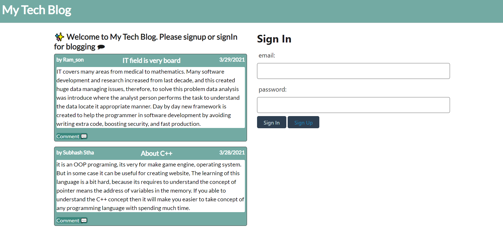
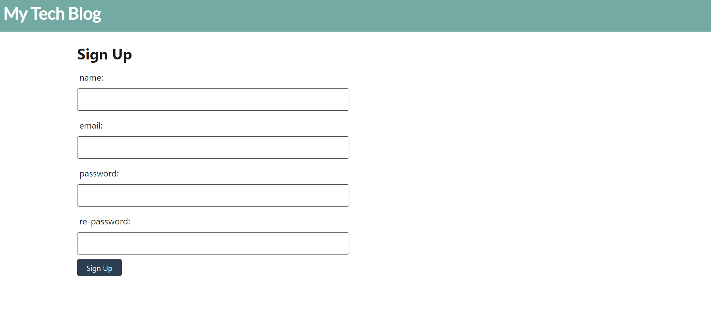
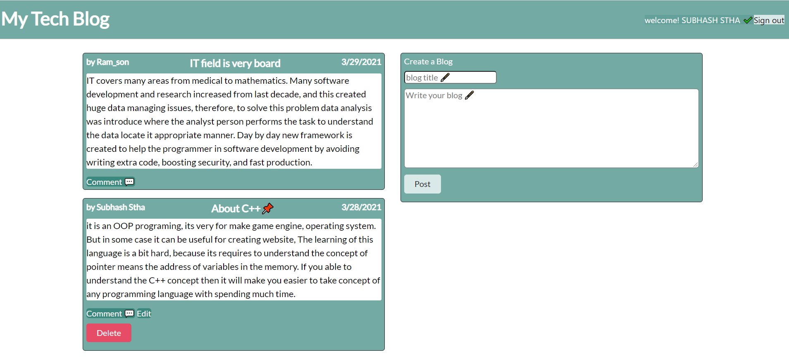
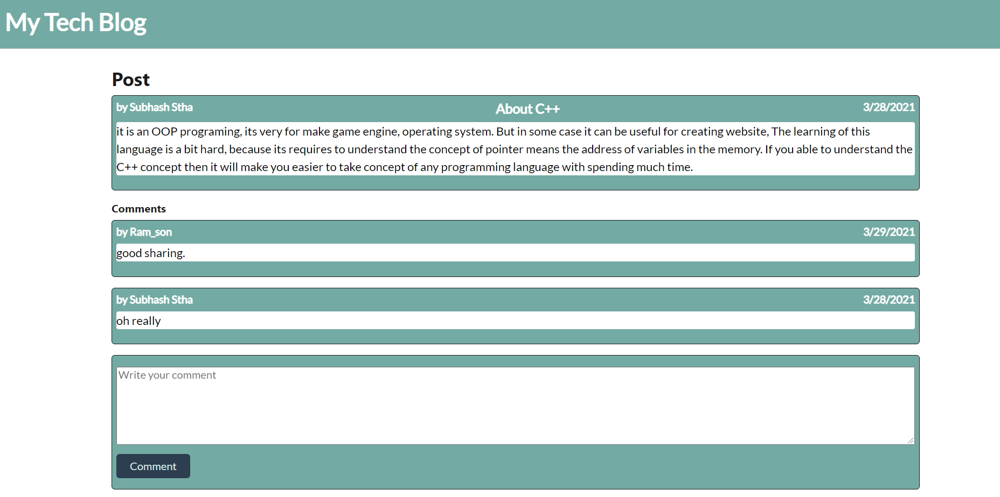
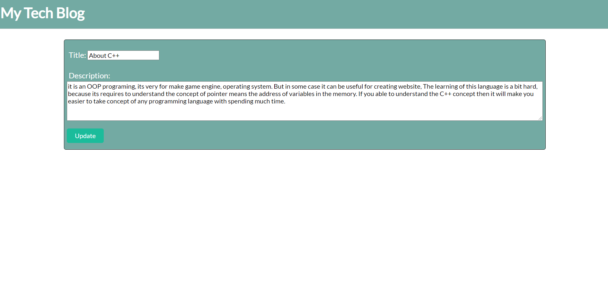

  # Title
  ## Employee Tracker
  
  
  
  ## Table of contents 
  - [Description](#description)
  - [Installation](#installation)
  - [Usage Information](#usage-information)
  - [License](#license)
  - [Contribution Guidelines](#contribution-guidelines)
  - [Test Procedure](#test-procedure)
  - [Screenshot](#screenshot)
  - [deployed](#deployed)
  - [Questions](#questions)
  
  ## Description
     This application built on nodejs, express, handlebars and sequelize. This application structure follows the Model-View-Controller pattern, and mysql2, dotenv, bcrypt library are used. Overall, this CMS style blog application gives 
     user to create account, update, delete the content, also allows to see the blog with sign on webapp.     

  ## Installation
     first need to clone from given github link and need to perform 'npm i' on terminal within the project location. 
     Second, type on terminal 'npm run seed' to get test for application if not then you can put your own data or 
     use application to create data.
     Third, 'node server.js' or 'npm start' to run the actual application. 
     Finally, the application will run and allows blogging.

  ## Usage Information
     It is useful to create blog on topic, and provides the platform for comment on blog. User can able to delete and edit 
     only their own blog but not others blog. User can comment on any blog after sign in to web application

  ## License
     MIT license
  
  ## Contribution Guidelines
     N/A

  ## Test Procedure
     N/A
  
  ## Screenshot
  ### welcome Screen
  

  ### sign up 
  
  
  ### dashboard 
  
  
  ### comment page
  

  ### edit page
    

  ## deployed
  
  
  ## Questions
    if you have questions then please feel free to contact on these addresses,
  Github: [SthaSub](https://github.com/SthaSub)
  
  Email: [subhashshrestha3@gmail.com](subhashshrestha3@gmail.com)
    